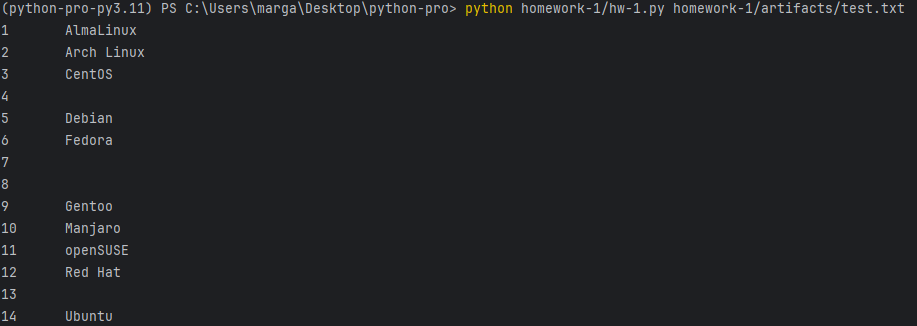
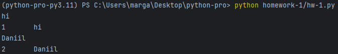
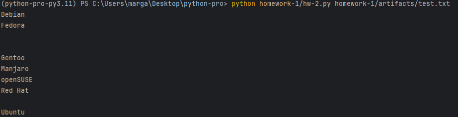
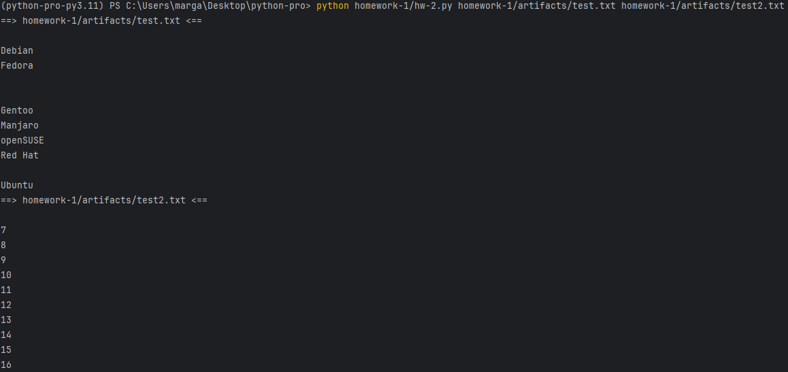
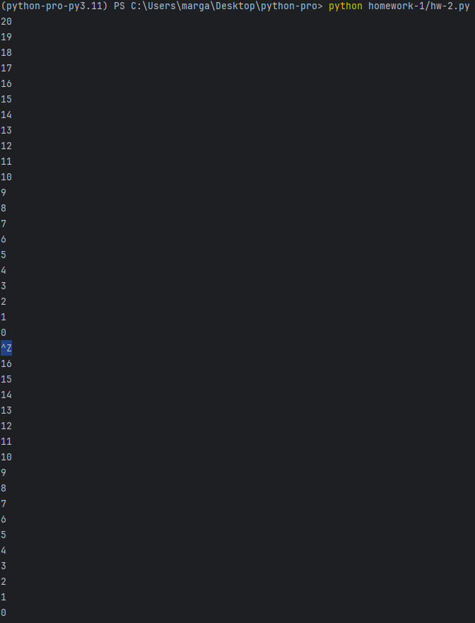
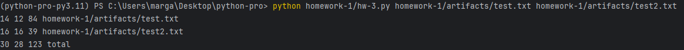
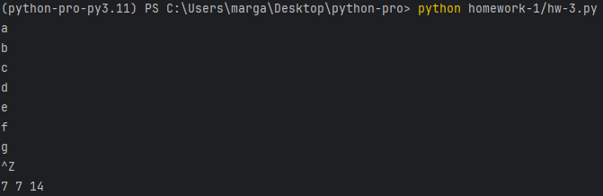

# HW 1.1 упрощенный вариант утилиты `nl`
### Если файл передан

### Если файл не передан

# HW 1.2 упрощенный вариант утилиты `tail`
### Если передан 1 файл

### Если передано 2 файла

### Если файл не передан

# HW 1.3 упрощенный вариант утилиты `wc`

### Если файл не передан
